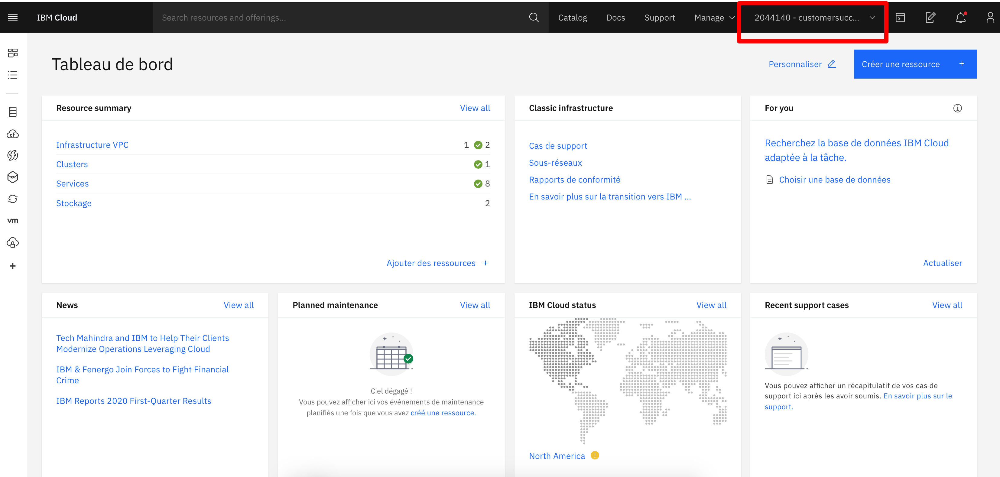

# Pre-requisites

Welcome to this first part of your application's installation ! We are going to check together if you've got access to everything you are going to use for your product.

## IBM Cloud Account

First, you should've an active IBM Cloud account by now.

Head to [IBM Cloud](https://cloud.ibm.com/login) and try to login. Login should be successful and you should have a screen looking somewhat like that.

    

> Pay attention to the red rectangle in the top right corner of the screenshot. This is the current role you are using. If you click on it, you should see the list of every roles you have access to.

## Github Account

Now, let's check you Github account. You should have a Github account with your name starting with `ifs-` and you should be a part of the **Bivwak!** (ifs-alpha) Organization. You can check it by following [this link](https://github.com). If you have all of this, then let's jump to the next step ! :)

## Circle CI

### Circle CI Account

First we have to check that you have access to Circle CI. So head to [Circle CI](https://circleci.com) and log in Circle CI using your Github account.

> It is very important that you use your Github account to log into Circle CI so it will give you access to the Bivwak (ifs-alpha) organization.

If you have correct access to Circle CI, you should see its dashboard and the Bivwak logo in the top right corner of the dashboard (cf. screenshot below).

    

### Circle CI Contexts

Now we'll have to check if you have access to Circle CI contexts for your product and all its environments. A Circle CI context is like a vault. It'll store some sensitive information about your product and its environment so you can remove it from your code. Then, when you'll push your application code, Circle CI will **automagically** do all the work for you. **Compile** your app, **Package** it, then **Deploy** it in the cloud!

On your Circle CI dashboard, you should see the gear in the menu on the left side (see the screenshot below). Let's click on it to go on the Circle CI settings. You should arrive directly on the **Contexts** page (see the screenshot below).

    
    

Use the search bar or scroll on the page to find your product name. You should see a context for each environment of your product. Each one of your contexts should have at least the following key/value pairs:

- IBMCLOUD_API_KEY
- CIRCLECI_ARTIFACTORY_PASSWORD
- CIRCLECI_ARTIFACTORY_USER
- TF_VAR_sharedcis_ibmcloud_api_key

Now you should be ready to jump into the next step, which will be about installing all of your architecture !

    <a href="../README.md" target="_blank">
        Back to homepage
    </a>
    &nbsp;&nbsp;•&nbsp;&nbsp;
    <a href="./starterkits.md" target="_blank">
        Next step
    </a>

