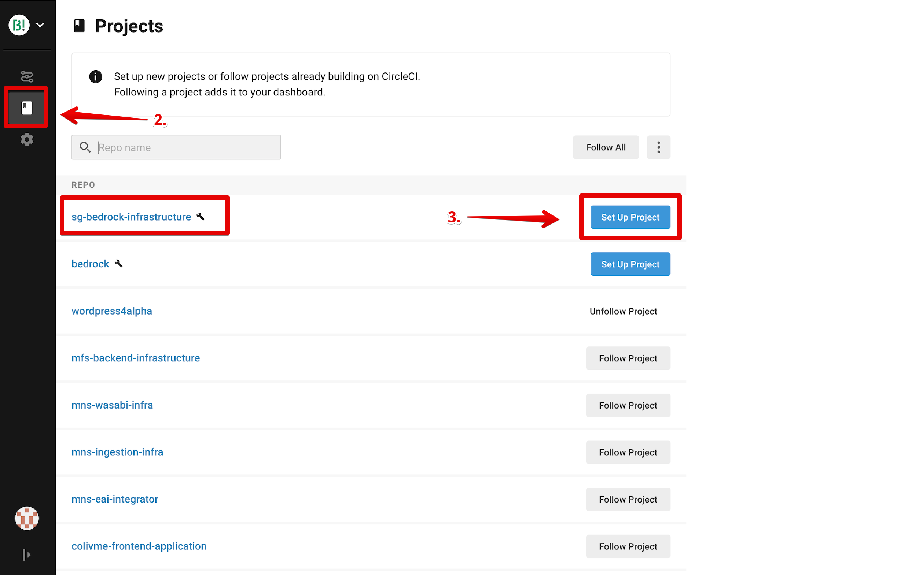
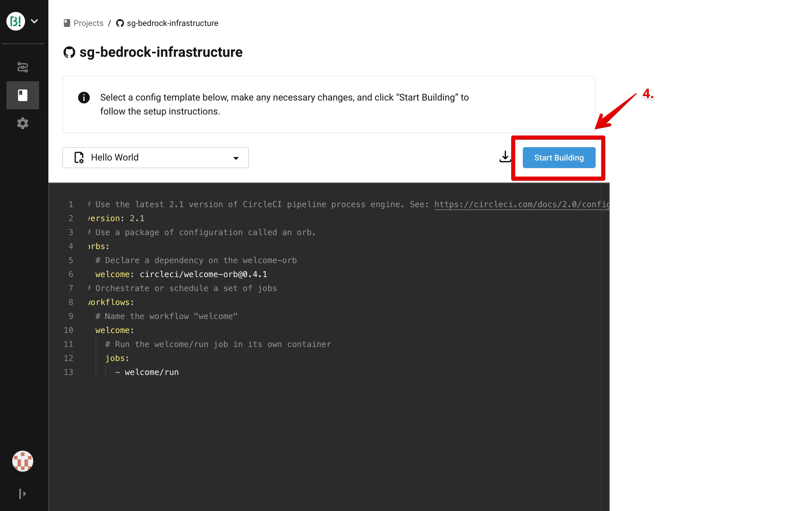
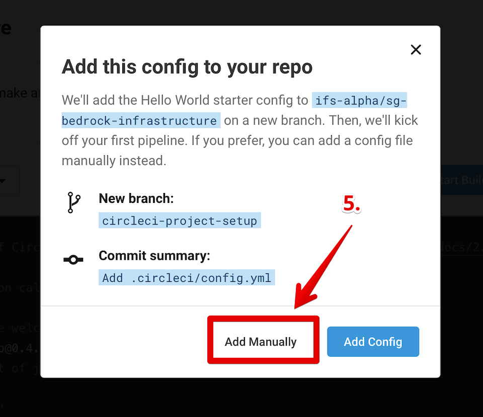
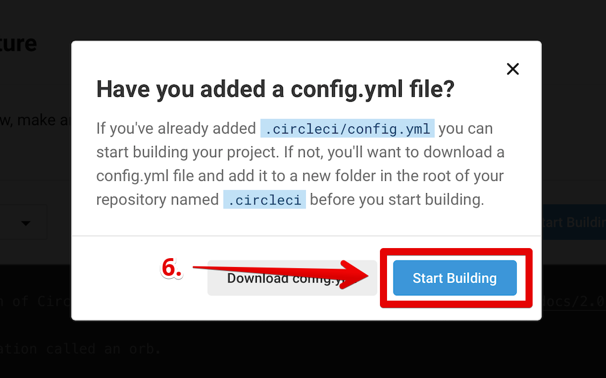

# Infrastructure Deployment

## Table of Content

1. [Pre-requisites](#pre-requisites)
2. [Create your Github code repository](#create-your-github-code-repository)
3. [Create your Starterkits configuration](#create-your-starterkits-configuration)
    - [Common information common.json](#common-information-commonjson)
    - [Cluster information k8s.json](#cluster-information-k8sjson)
    - [COS information cos.json](#cos-information-cosjson)
    - [PostgreSQL information postgresql.json](#postgresql-information-postgresqljson)
    - [MongoDB information mongodb.json](#mongodb-information-mongodbjson)
    - [Redis information redis.json](#redis-information-redisjson)
4. [Configure your pipeline](#configure-your-pipeline)
5. [Deployment Time!](#deployment-time)
6. [Cluster update procedure](#cluster-update-procedure)
7. [Upgrade versions](#upgrade-versions)
   
## Pre-requisites

- `TF_BACKEND_ENDPOINT`: the `endpoint` to access your Terraform Backend
- `TF_BACKEND_APIKEY`: the `apikey` to access your Terraform Backend
-`TF_BACKEND_STORAGE_ELEMENTS`: a base64 encoded parameter (bucket_name, cos_id, bucket_apiEndpoint) to make terraform backend cloudfunction generic

Note that those information should have been set for you in your *CircleCI* context.

## Create your Github code repository

Before we can configure your infrastructure, we need a way to store it. So head to [Github](https://github.com) and create a new repository. As owner, select the Bivwak! Organization, create your repo as private, and check the option to initiate it with a README file (What could we do without a documentation, right ? ;) ). About the name, we recommend you name it using the following template : `<product_name>-infrastructure`.

Then, go your newly created repository settings, and invite `ifs-alpha/<your-team>` team. Make sure to replace `<your-team>` with your team name. Give this team **Admin** access. If you want, you can also add `ifs-alpha/CoreTeam` as a Reader or whatever you want. Then in the users list, delete yourself. Indeed, you should have access through your team and not on your own.

Finally, clone your repository somewhere, so we can work inside it later.

That's it! we are good to go! :)

## Create your StarterKits configuration

To create your infrastructure molecule, we are going to use **Starter Kits**. It's a Tech Tribe product which goals is to make it easy for you to create your infrastructure in the cloud. Here we are going to review all the basic information you need to create an infrastructure, but if you want more technical information, feel free to check [Starter Kits' documentation](https://github.com/ifs-alpha/bivwak-ibm-container-service/tree/0.5.0).
First we need to create a folder for our infrastructure configuration depending on the environment.

Templates can be found and cloned from this repository from `environments/`. Feel free to clone this repository and fill/customize the configuration ;)

*N.B: note that the configuration has been splitted into several files but you can choose to have one big file.*

### Common information `common.json`

Customize this file using your own values. Those informations are used by all resource of the infrastructure (tagging, region deployment ...)

```json
{
    "region": "eu-de",
    "project": "YOUR_PROJECT",
    "environment_type": "integration",
    "environment_id": "int",
    "application_name": "YOUR_APP_NAME",
    "starterkits_rg": "TARGET_RESOURCE_GROUP_NAME",
    "vpc_name": "VPC_NAME",
    "landing_zone_rg" : "Default",
    "landing_zone_activity_tracker_instance_name" : "ACTIVITY_TRACKER_NAME",
    "landing_zone_sysdig_instance_name" : "SYSDIG_NAME",
    "landing_zone_logdna_instance_name" : "LOGDNA_NAME",
    "cis_instance_info": {
      "blocked_countries": [
        "IR",
        "SY",
        "SD",
        "CU",
        "SS"
      ]
    },
    "domains": {
      "YOUR_DOMAIN_NAME": {
        "subdomains": {
          "YOUR_SUBDOMAIN_NAME": {
            "rate_limiting_rule": {
              "methods": [
                "GET", 
                "POST", 
                "PUT", 
                "DELETE", 
                "PATCH", 
                "HEAD"
              ],
              "threshold": 20,
              "period": 900,
              "timeout": 43200,
              "response_type": "text/plain",
              "response_body": "custom response body"
            }
          },
          "ingress_authorized_ips": [
            "0.0.0.0/0", 
            "::/0"
          ]
        }
      }
    }
}
```

You can see some parameters where we put placeholders. Let's review each one of them together to explain what value you should enter and where to find every piece of info.

- `region`: The region where the infrastructure will be deployed in IBM Cloud Public. (Value `eu-de` should not be changed.)
- `project`: This is your project name. You can basically choose anything. Variables are often used to create domain names or instances names so don't use funny characters or it may not work well.
- `environment_id`: This is the id of the environment your are going to deploy your infrastructure on (An account can contain several environments: example dev, test, stage in integration, pre-release in candidate, ...). We recommend using the same name as the role you are working with, eg. `integration`, `candidate`, `release` or `sandbox`. ** Note that most of provisioned resources will be prefixed with `environment_id` for their name **.
- `environment_type`: The environment typology (example integration, candidate, release)
- `application_name`: If your project is composed of several subcomponents you can use this field to distinguish your deployment. Use same as project in other case.
- `starterkits_rg`: Target resource group for resource deployment by the service. Note that the resource group must exist first. NB: those scripts does not create this resource group. `ibmcloud resource group-create <you_resource_group>`
- `vpc_name`: The name of the VPC created by the landing zone. You can retrieve it in the resource list of the IBM Cloud GUI or execute `ibmcloud ks vpcs --provider vpc-gen2`.
- `landing_zone_rg`: The name of the *Landing Zone product* resource group where landing zone resources are attached. Usually it is in *Default*.
- `landing_zone_activity_tracker`: The name of the Activity Tracker instance provisioned by *Landing Zone product*. Consult the resource list in your IBM Console to retrieve it. Usually it is *bivwak-activitytracker-de*.
- `landing_zone_sysdig_instance_name`: The name of Sysdig instance provisioned by *Landing Zone product*. Consult the resource list in your IBM Console to retrieve it. Usually it is *bivwak-monitorSysdig*.
- `landing_zone_logdna_instance_name`: The name of LogDNA instance provisioned by *Landing Zone product*. Consult the resource list in your IBM Console to retrieve it. Usually it is *bivwak-logAnalysis*.
- `blocked_countries`: The list of countries to block from communicating with the domains. The recommended default value  is `["IR","SY","SD","CU","SS"]` where `IR`: Islamic Republic of Iran, `SY`: Syrian Arab Republic, `SU`: Sudan, `CU`: Cuba and `SS`: South Sudan.
- `domains`: a map of object describing a domain with 1 to n subdomains
    - `key` : the domain name
        - `subdomains` : a map of object describing a subdomain
            - `key`: the subdomain name. If `self` is used as key, the configuration will be applied on the top level domain.
                - `rate_limiting_rule`: a map of objects describing a rate limiting rule for an IBM Cloud Internet Services domain.
                    - `threshold`: the number of requests received within a specific time period before connections to the domain are refused.
                    - `period`: the period of time in seconds where incoming requests to a domain are counted. If the number of requests exceeds the threshold, then connections to the domain are refused.
                    - `methods`: a list of HTTP methods that the incoming request can use to be counted towards the threshold.
                    - `timeout`: the time to wait in seconds before an action is performed (when incoming requests exceed the specified `threshold`).
                    - `response_type`: the content-type of the body that you want to return (when incoming requests exceed the specified `threshold`). should be `text/plain`, `text/xml`, and `application/json`.
                    - `response_body`: the body of the response that you want to return to the client (when incoming requests exceed the specified `threshold`). must be match the `response_type` that you specified.
                - `ingress_authorized_ips`: The list of authorized IPs (IPV4 and/or IPV6) or network to access the cluster. You may restrict your development and testing environments for instance. see [IP CIDR Notation](https://www.digitalocean.com/community/tutorials/understanding-ip-addresses-subnets-and-cidr-notation-for-networking#CIDR%20Notation).


### Cluster information `k8s.json`

To run your backend and your frontend, we need to deploy a kubernetes (k8s) cluster inside your infrastructure. So let's see how to configure your file to add this cluster.

```json
{
  "cluster_info": {
    "cluster_name": "CLUSTER_NAME",
    "kube_version": "1.21",
    "machine_type": "cx2.4x8",
    "worker_count": "1",
    "high_availability" : false,
    "namespaces": [
      "my-namespace"
    ],
    "worker_pools": {
      "YOUR_WORKER_POOL_NAME": {
        "machine_type": "cx2.4x8",
        "min_size": 1,
        "max_size": 1,
        "labels": {
          "app" : "test-pool-one",
          "env" : "test-one"
        }
      }
    },
    "sysdig_filters": {
      "includes": ["YOUR_SYSDIG_FILTER_KEY:YOUR_SYSDIG_FILTER_VALUE"]
    }
  }
}  
```

Once again, let's review the parameters you need to change.

- `cluster_name`: Choose a name for your cluster. (Follow manual procedure link for [cluster update](#cluster-update-procedure))
- `kube_version`: The version of kubernetes you want to provision, you can either choose a normal IKS cluster (advised values : "1.19", "1.20", "1.21" IBM Kubernetes Service default version is 1.21 (2021-10)) or an Openshift cluster (advised values: "4.8.18_openshift")
- `machine_type`: the worker type of you k8s cluster. Refer to documentation for available. You can retrieve the list of flavor using `ibmcloud ks flavors --zone eu-de-1 --provider vpc-gen2`. (Follow manual procedure link for [cluster update](#cluster-update-procedure))
- `high_availability`: indicates if you wants your cluster to deploy deployed in a multi-zone way (for 2 zones, set `true`) or in a single-zone (set `false`)
- `worker_count`: number of worker **per** zone.
- `namespaces`: Put here a list of strings which will be your cluster's namespaces. In a basic situation, with a frontend and a backend, you should at least have a frontend and a backend namespaces.
- `worker_pools`: a map of `worker_pool` objects.
    - `key`: the key of each `worker_pool` will be used as its name
    - `machine_type`: The machine type (vcpu, ram, ..etc) of the VPC worker node. You can retrieve the list of flavor using `ibmcloud ks flavors --zone eu-de-1 --provider vpc-gen2` (Follow manual procedure link for [cluster update](#cluster-update-procedure))
    - `min_size`: the minimun size of instance(s) in each zone (minimum size should >= 1).
    - `max_size`: the maximum size of instance(s) in each zone for autoscaling (minimum size should >= 1).
    - `labels`: a map of string, empty value is possible by using {}. Labels will be set at node object level as kubernetes labels, a default label with the woker pool name as value will be always added. They are displayed in the Kubernetes dashboard on nodes resources and in the IBM Cloud console on worker pools resources.
- `sysdig_filters` Filters to apply on sysdig agent. By default we excluded all metrics.
    - `includes`: the list of filters to add to sysdig agent (eq: "kubernetes.namespace.name:sk-e2e-backend")

More example about `worker_pools` with different types of configuration :

<u>No worker pool</u>

````
    "worker_pools": {
    }
````

<u>Multiple worker pools</u>

````
    "worker_pools": {
      "pool1": {
        "machine_type": "cx2.4x8",
        "min_size": 1,
        "max_size": 1,
        "labels": {
          "app" : "test-pool-one",
          "env" : "test-one"
        }
      },
      "pool2": {
        "machine_type": "cx2.4x8",
        "min_size": 1,
        "max_size": 1,
        "labels": {
        }
      }
    }
````

<u>Deploy an Openshift cluster</u>

To deploy an Openshift cluster, all you have to do is specify which version in the `kube_version` field

```json
{
  "cluster_info": {
    ...
    "kube_version": "4.8.18_openshift",
    ...
  }
}  
```

Note that it has not the same functionnalities nor the same security policies of a normal IKS cluster

#### Login to your cluster

Downloading your KUBECONFIG won't be enough to interact with your cluster, you'll have to execute an openshift command with the `oc` cli

```bash
oc login -u apikey -p $IBMCLOUD_API_KEY
```

#### Configuration of your ingress

Unlike the normal IKS cluster, you'll have to explicitly specify the TLS Kubernetes secret on your ingress YAML:

```yaml
...
spec:
  tls:
    - hosts:
        - host1.ifsalpha.com
      secretName: test-cluster-openshift-tls-secret # Add this line
...
```

The secret name is: `{environment_id}-{cluster_info.cluster_name}-openshift-tls-secret`

### COS information `cos.json`

Optionally you can add a COS instance to your infrastructure with multiple Buckets.  In that case, all the configuration (endpoints) and credentials will be automatically provisionned in to the kubernetes cluster.

To do so, we are going to add a new object called `cos_instance_info`. See the code below to see where you need to put it inside your file.

```json
{
  "cos_instance_info": {
    "cos_instance_name": "COS_NAME",
    "bucket_iam_role": [
      "Reader",
      "Writer"
    ],
    "application_allowed_ips": [
          "0.0.0.0/0",
          "::/0"
    ],
    "backup_config": {
      "backup_expire_days" : 365,
      "backup_scheduler": "0 0 1 * *",
      "backup_prefix_format": "%Y-%m-%d"
    },
    "buckets": {
      "YOUR_BUCKET_NAME": {
        "storage_class": "standard",
        "force_delete": false
      }
    }
  }
}
```

As we did before, let's explain the placeholder information you need to replace here.

- `cos_instance_name`: The name of the Cloud Object Storage instance. It will be prefixed with `environment_id`, (must consist of lowercase letters, numbers and dashes).
- `bucket_iam_role`: List of role to apply to the credentials of COS. (Reader, Writer)
- `application_allowed_ips`: The list of IPs allowed to access the bucket instance. *Important note: due to IBM Cloud issue, you need to allow your IP to administrate the Buckets, otherwise you won't be able to access it*
- `backup_config` : Object representing the backup configs.There is no backup for buckets if value is null.
    - `backup_expire_days`: Specifies the number of days when objects are deleted
    - `backup_scheduler`: Specifie a cron to backup objects 
    - `backup_prefix_format`: Specifie a linux prefix timestamp format for objects in backup buckets. Example : %Y-%m-%d
- `buckets`: Map of object representing the buckets instances.
    - `buckets.key`: the name of the bucket
    - `buckets.storage_class`: Storage class of the bucket. Accepted values: `standard`, `vault`, `cold`, `flex`
    - `force_delete`: Enable forcing the deletion of non empty buckets. Accepted values are : `true` or `false`(recommended). 

**COS de-activation**

With the StarterKits, you can choose not to use a COS backend service. In that case, remove the file `cos.json` from the list or omit `cos_instance_info` object in your configuration.

**COS - K8S Integration**

Your application will be able to access this COS by using the Kubernetes Secret `application-secrets` provisioned in your namespace. This object contains the following keys related to COS credentials:

 - `cos-api-key`: API Key used by the COS Bucket SDK
 - `cos-access-key-id`: Access Key to use the AWS S3 SDK
 - `cos-secret-access-key`: Secret Access Key to use the AWS S3 SDK

 Also configuration such like endpoints are also integrated to your namespace, in Kubernetes ConfigMap `application-config-maps`. This object contains the following keys related to COS configuration:

 - `cos_id`: (optional) cos identifier

 See [COS Atom documentation](https://github.com/ifs-alpha/bivwak-ibm-cos-module/tree/0.4.0) for more information on COS credentials usage.


### PostgreSQL information `postgresql.json`

Optionally you can add a PostgreSQL instance to your infrastructure. In that case, all the configuration (endpoints) and credentials will be automatically provisionned in to the kubernetes cluster.

To do so, we are going to add a new object called `postgresql_instance_info`. See the code below to see where you need to put it inside your file.

```json
{
  "postgresql_instance_info": {
    "name": "POSTGRESQL_NAME",
    "plan": "standard",
    "version": "latest",
    "members_memory_allocation_mb": 6144,
    "members_disk_allocation_mb": 30720
  }
}
```

As we did before, let's explain the placeholder information you need to replace here.

- `name`: This is your database's name. Choose whatever you want.
- `plan`: The name of the plan type for an IBM Cloud Database. (Currently the only available value is `standard`)
- `version`: The version of your postgresql instance. You can use `latest` to provision the latest stable version of postgresql or choose your own one with `ibmcloud cdb deployables-show`
- `members_memory_allocation_mb`: The memory size for the database, split across all members. If `null` value used then default values are applied. These vary by database type. See the documentation related to each database for to [defaults](https://cloud.ibm.com/docs/services/databases-for-postgresql/howto-provisioning.html#list-of-additional-parameters)
- `members_disk_allocation_mb`: The disk size of the database, split across all members. As above.

**PostgreSQL de-activation**

With the StarterKits, you can choose not to use a postgresql backed service. In that case, remove the file `postgresql.json` from the list or omit `postgresql_instance_info` object in your configuration.

**PostgreSQL - K8S Integration**

Your application will be able to access this PostgreSQL by using the Kubernetes Secret `binding-<<environment>>-<<db_instance_info.name>>` provisioned in your namespace. This object contains the following keys related to PostgreSQL credentials:

- `host`: The private endpoint of your postgreSQL instance.
- `dbname`: The name of your postgresql database hosted by the instance.
- `user`: The admin user to connect your database hosted in the instance.
- `password`: The admin password to connect your database hosted in the instance (it is base64 encrypted).

**PostgreSQL backups and Restore**

Backups and restore procedures are described in these links :

- [Backup](https://github.com/ifs-alpha/bivwak-ibm-postgresql-module/blob/master/README.md#backups)
- [Restore](https://github.com/ifs-alpha/bivwak-ibm-postgresql-module/blob/master/README.md#restore)

### MongoDB information `mongodb.json`

Optionally you can add a MongoDB instance to your infrastructure. In that case, all the configuration (endpoints) and credentials will be automatically provisionned in to the kubernetes cluster.

To do so, we are going to add a new object called `mongodb_instance_info`. See the code below to see where you need to put it inside your file.

```json
{
  "mongodb_instance_info": {
    "name": "MONGODB_NAME",
    "plan": "standard",
    "version": "latest",
    "members_memory_allocation_mb": 6144,
    "members_disk_allocation_mb": 30720,
    "authorized_ips": [ 
      "0.0.0.0/0", 
      "::/0"
    ]
  }
}  
```

As we did before, let's explain the placeholder information you need to replace here.

- `name`: This is your database's name. Choose whatever you want.
- `plan`: The name of the plan type for an IBM Cloud Database. (Currently the only available value is `standard`)
- `version`: The version of your postgresql instance. You can use `latest` to provision the latest stable version of postgresql or choose your own one with `ibmcloud cdb deployables-show`
- `members_memory_allocation_mb`: The memory size for the database, split across all members. If `null` value used then default values are applied. These vary by database type. See the documentation related to each database for to [defaults](https://cloud.ibm.com/docs/services/databases-for-postgresql/howto-provisioning.html#list-of-additional-parameters)
- `members_disk_allocation_mb`: The disk size of the database, split across all members. As above.
- `authorized_ips`: The list of IPs allowed to access the mongodb instance.

**MongoDB de-activation**

With the StarterKits, you can choose not to use a postgresql backed service. In that case, remove the file `mongodb.json` from the list or omit `mongodb_instance_info` object in your configuration.

**MongoDB - K8S Integration**

Your application will be able to access this mongodb by using the Kubernetes Secret `binding-<<environment>>-<<db_instance_info.name>>` provisioned in your namespace. This object contains the following keys related to mongodb credentials:

- `host`: The private endpoint of your mongodb instance.
- `dbname`: The name of your mongodb database hosted by the instance.
- `user`: The admin user to connect your database hosted in the instance.
- `password`: The admin password to connect your database hosted in the instance (it is base64 encrypted).

**Mongodb backups and Restore**

Backups and restore procedures are described in these links :

- [Backup](https://github.com/ifs-alpha/bivwak-ibm-mongodb-module/blob/master/README.md#backups)
- [Restore](https://github.com/ifs-alpha/bivwak-ibm-mongodb-module/blob/master/README.md#restore)

### Redis information `redis.json`

Optionally you can add a MongoDB instance to your infrastructure. In that case, all the configuration (endpoints) and credentials will be automatically provisionned in to the kubernetes cluster.

To do so, we are going to add a new object called `redis_instance_info`. See the code below to see where you need to put it inside your file.

```json
{
  "redis_instance_info": {
    "name": "REDIS_NAME",
    "plan": "standard",
    "version": "latest",
    "members_memory_allocation_mb": 6144,
    "members_disk_allocation_mb": 30720,
    "authorized_ips": [ 
      "0.0.0.0/0", 
      "::/0"
    ]
  }
}
```

As we did before, let's explain the placeholder information you need to replace here.

- `name`: This is your database's name. Choose whatever you want.
- `plan`: The name of the plan type for an IBM Cloud Database. (Currently the only available value is `standard`)
- `version`: The version of your postgresql instance. You can use `latest` to provision the latest stable version of postgresql or choose your own one with `ibmcloud cdb deployables-show`
- `members_memory_allocation_mb`: The memory size for the database, split across all members. If `null` value used then default values are applied. These vary by database type. See the documentation related to each database for to [defaults](https://cloud.ibm.com/docs/services/databases-for-postgresql/howto-provisioning.html#list-of-additional-parameters)
- `members_disk_allocation_mb`: The disk size of the database, split across all members. As above.
- `authorized_ips`: The list of IPs allowed to access the redis instance.

**Redis de-activation**

With the StarterKits, you can choose not to use a postgresql backed service. In that case, remove the file `redis.json` from the list or omit `redis_instance_info` object in your configuration.

**Redis - K8S Integration**

Your application will be able to access this redis by using the Kubernetes Secret `binding-<<environment>>-<<db_instance_info.name>>` provisioned in your namespace. This object contains the following keys related to redis credentials:

- `host`: The private endpoint of your redis instance.
- `dbname`: The name of your redis database hosted by the instance.
- `user`: The admin user to connect your database hosted in the instance.
- `password`: The admin password to connect your database hosted in the instance (it is base64 encrypted).

**Redis backups and Restore**

Backups and restore procedures are described in these links :

- [Backup](https://github.com/ifs-alpha/bivwak-ibm-redis-module/blob/master/README.md#backups)
- [Restore](https://github.com/ifs-alpha/bivwak-ibm-redis-module/blob/master/README.md#restore)

#### Domain Name

When the **Landing Zone** product created your account, it created a domain name for your on a sharedcis hosted on a sharedaccount, so let's see how you can retrieve information about your domain.

NB: the domain names usually have the following format <<project>>-<<environment>>.ibm.ifsalpha.com

1. Get your shared cis api key (this key allow you to interact with your domain name in sharedcis account)
2. Export the key to be able to log on sharedcis account (export IBMCLOUD_API_KEY=<< your sharedcis api key >>)
3. Log on ibmcloud (ibmcloud login)
4. Set the sharedcis instance (ibmcloud cis instance-set sharedcis)
5. Request the sharedcis to check domain and get your domain id (ibmcloud cis domains -i sharedcis --page=<< page number >> --output json |jq '.[] | select(.name=="<< your domain name >>") | .id' |sed "s/\"//g"). Be careful to browse sharedcis pages until you find your domain id.
6. Check your domain settings (ibmcloud cis domain-settings << your domain id >> --output json)
7. Check your dns records (ibmcloud cis dns-records << your domain id >> --output json)
8. Check your rate limit rules (ibmcloud cis ratelimit-rules << your domain id >> --output json)
9. Check your firewall lockdowns (ibmcloud cis firewalls -t lockdowns -d << your domain id >> --output json)


## Configure your pipeline

Now that we configured your infrastructure, you probably to deploy it all, don't you ?

Well, It's going to require a small new step before we get to that point. Indeed, to be compliant with Bivwak security guidelines and everything, you need to make all of your deployment through **Bivwak's Pipeline**. But, what's a Pipeline ?

A pipeline is all of the automated tools that'll get triggered when you push your code on your git repository. Hopefully, this requires only a single file to be able to trigger it all! So let's dive right in, shall we ? :)

On your infrastructure repository, create a `.circleci` folder. Inside of this folder, create a `config.yml` file or use the example provided in `.circleci`
Then, copy the following code and paste it inside the `config.yml` file:

```yaml
version: 2.1

orbs:
  utils-orb: bivwak/utils-orb@0.0.45
  starterkits: bivwak/starterkits-orb@2.5.1

workflows:
  deploy_sk_integration:
    jobs:
      - utils-orb/inject_backend_terraform:
          context: YOUR_INTEGRATION_CONTEXT
          name: inject_tf_backend
          state_key: $(TARGET_ENVIRONMENT=${CIRCLE_PROJECT_REPONAME}-integration; TARGET_ENVIRONMENT=$(echo ${TARGET_ENVIRONMENT} | tr '[:upper:]' '[:lower:]'); echo $TARGET_ENVIRONMENT)
          filters:
            branches:
              only:
                - develop
      - starterkits/deploy_module:
          context: YOUR_INTEGRATION_CONTEXT
          requires:
            - inject_tf_backend
          module: bivwak-ibm-container-service
          version: 0.17.0 # See https://github.com/ifs-alpha/bivwak-ibm-container-service/releases for more information
          path_vars: environments/integration
          terraform_version: 1.0.7
          filters:
            branches:
              only:
              - develop
  deploy_sk_candidate:
    jobs:
      - utils-orb/inject_backend_terraform:
          context: YOUR_CANDIDATE_CONTEXT
          name: inject_tf_backend
          state_key: $(TARGET_ENVIRONMENT=${CIRCLE_PROJECT_REPONAME}-candidate; TARGET_ENVIRONMENT=$(echo ${TARGET_ENVIRONMENT} | tr '[:upper:]' '[:lower:]'); echo $TARGET_ENVIRONMENT)
          filters:
            branches:
              only:
                - release
      - starterkits/deploy_module:
          context: YOUR_CANDIDATE_CONTEXT
          requires:
            - inject_tf_backend
          module: bivwak-ibm-container-service
          version: 0.17.0 # See https://github.com/ifs-alpha/bivwak-ibm-container-service/releases for more information
          path_vars: environments/candidate
          terraform_version: 1.0.7
          filters:
            branches:
              only:
              - release
  deploy_sk_release:
    jobs:
      - utils-orb/inject_backend_terraform:
          context: YOUR_RELEASE_CONTEXT
          name: inject_tf_backend
          state_key: $(TARGET_ENVIRONMENT=${CIRCLE_PROJECT_REPONAME}-release; TARGET_ENVIRONMENT=$(echo ${TARGET_ENVIRONMENT} | tr '[:upper:]' '[:lower:]'); echo $TARGET_ENVIRONMENT)
          filters:
            branches:
              only:
                - master
      - starterkits/deploy_module:
          context: YOUR_RELEASE_CONTEXT
          requires:
            - inject_tf_backend
          molecule: bivwak-ibm-container-service
          version: 0.17.0 # See https://github.com/ifs-alpha/bivwak-ibm-container-service/releases for more information
          path_vars: environments/release
          terraform_version: 1.0.7
          filters:
            branches:
              only:
              - master
```

Let's explain a little bit what we are doing here. First, we use Circle CI to execute a bunch of scripts when you push code to your repository. And this file is telling Circle CI what it should do and when it should do it. How does this work ? Well, when you'll push code to your repository, CircleCI will trigger **workflows**. Workflows are made from a bunch of **jobs**. Each jobs is about performing a certain task with your code like compiling it, testing it, deploying it, etc etc...

Here, we can see a simple workflow named `deploy_sk_integration`. Its job is to deploy your infrastructure on your integration environment. You can filter on which branch your jobs should get executed. For instance, if your follow a **Gitflow** workflow for your git repository, integration environment should get updated whenever a commit on the **develop** is performed. That's why you can find filters on the job we created for you indicating these jobs should get performed only on the `develop` branch.

However, we need you to replace some placeholders in this file, as you probably guessed from the `<>` characters. So let's review all of these placeholders and see what you should put in place of these:

- `your_context`: is your Circle CI context name, the one we check re-requisites for earlier. Pay attention to choose the right context for your integration environment
- `path_vars`: if you followed our recommendations and used `environments/integration` to put your infrastructure config file, then you should put `environments/integration` here. Basically, it's the path to your infrastructure's configuration file. Of course it depends on the environment you want to deploy.

Well, now your Pipeline is configured. Congrats !

There's one final step for Circle CI to work properly. Indeed, for now, it is not setup in Circle CI. So let's follow these steps to setup your project so it can work (see the screenshots below if you need assistance):

1. Head to [Circle CI](https://circleci.com) and log in using your github account.
2. On the left menu bar, click on the **Projects** tab.
3. You should see your new infrastructure repository at the top of the list. If not, search it using the searchbar and click on **Set Up Project**
4. On this new window, click on **Start Building**
5. In the popin, click on **Add Manually**
6. In this new popin, click on **Start Building**

<p align="center">
    
    
    
    
</p>

Now, your project is set up! You'll see Circle CI try to run a workflow on your master branch. But since you haven't configured a Circle CI file on your master branch, it will fail. but that's fine.

You can now create a develop branch and push your code on this branch.

## Deployment Time!

Now, if you head back to Circle CI, you should see your workflow running. Be patient, because the installation of your infrastructure can take up to an hour. It's a very long process. Check if everything is running smoothly and it should be fine ! :)

<p align="center">
    <a href="./prerequisites.md" target="_blank">
        Previous step
    </a>
    &nbsp;&nbsp;•&nbsp;&nbsp;
    <a href="../README.md" target="_blank">
        Back to homepage
    </a>
</p>


### Cluster update procedure

This procedure exists because of ibm terraform provider inappropriate behaviour. Follow IBMCloud Terraform Provider issue ([Issue #1755](https://github.com/IBM-Cloud/terraform-provider-ibm/issues/1755))

**IMPORTANT NOTE:**
Changing the below two values after cluster creation will cause a deletion of all kubernetes resources

- `cluster_name`
- `machine_type`

Here is the procedure to update correctly your cluster


```shell
terraform init

VAR_FILE_ARGS=""
for conf_file in ${CONFIGURATION_FILEPATH}/*
do
    VAR_FILE_ARGS+=" -var-file=${CONFIGURATION_FILEPATH}/${conf_file##*/}"
done

for item in $(terraform state list | grep 'kubernetes\|patch_default_sa_with_image_pull_secrets\|add_label_to_kubesystem_namespace'); do terraform state rm $item; done

terraform apply ${VAR_FILE_ARGS} --auto-approve
````

Follow this link for [implementation sample with README and circleci workflow](https://github.com/ifs-alpha/bivwak-ibm-terraform-revival)

## Upgrade versions

- Move to container molecule [0.17.0](upgrades/upgrade_to_version_0_17_0.md)

## Tutorials

- From level 1 to level 2 ([Documentation](tutorials/from-level-1-to-level-2.md))
